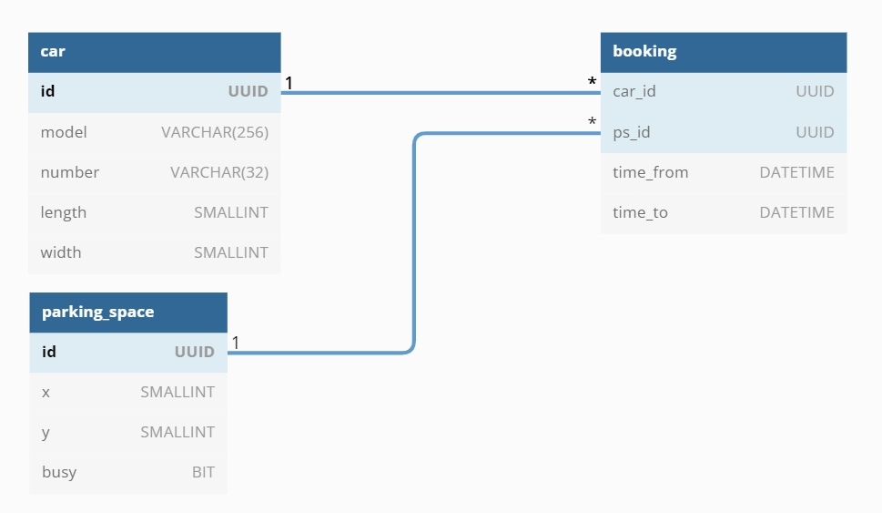

## Курсовая работа по курсу Tinkoff Fintech
## Бронироавние парковочных мест

### Полезные ссылки:
- Приложение размещено на хостинге Heroku: [тык](https://parking-reservation-tinkoff.herokuapp.com/)
- Коллекция запросов Postman: [тык](https://web.postman.co/workspace/Parking-Reservation~8188e665-e115-4ee7-8965-24ae1490ebed)

### Использованные технологии:
Backend:
- Spring Boot
- PostgreSQL
- MyBatis
- Flyway
- Spring Security

### Схема данных:

### Постановка задачи:

В офисах Тинькофф существует бесплатная парковка для сотрудников.
Проблема в том, что сейчас никак не отслеживается прогресс бронирования.
Подъезжая к офису, нельзя быть уверенным, что на парковке будут свободные места.
Необходимо реализовать приложение для бронирования парковочного места и получения статистики.

1) Спроектировать модель данных парковочных мест и машин сотрудников.
Парковочное место должно иметь:
- информацию о расположении по отношению к другим парковочным местам
- может быть свободно/занято

У автомобиля должны быть:
- модель
- габариты
- номер

Добавить модель для самого бронирования:
- у бронирования есть время старта и окончания
- ссылки на машину и на сотрудника
- период бронирования не может быть > 24 часов - незакрытая бронь автоматически закрывается в 00:00 каждого дня
- бронировать автомобиль нельзя в субботу и воскресенье

Один автомобиль может занять только одно парковочное место

2) Реализовать API для управления моделями и парковочными местами (CRUD), необходимые валидации и исключения.

3) Добавить ролевую модель - только пользователь ADMIN может управлять парковочными местами и автомобилями.
Пользователь USER может управлять бронированиями и просмотром парковочных мест.
Добавляем двух пользователей - с ролью ADMIN и с ролью USER.

4) Добавить API для бронирования - сотрудник может забронировать свободное место на определенное время 1-24 часа.
По истечению этого времени бронь должна сниматься.